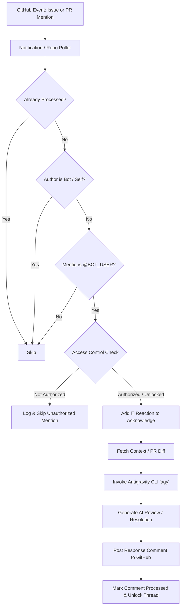

# GitHub AI Review & Assistant Agent

An autonomous GitHub review and coding assistant agent powered by Google Antigravity CLI (`agy`). The bot continuously monitors GitHub notifications and repository comments, reviews pull request diffs, answers issues, executes code modifications, and responds directly on GitHub threads.

---

## Architecture & Workflow



---

## Features

- **Automated Code Reviews & Assistance**: Leverages Antigravity CLI (`agy`) to inspect diffs, test builds, review pull requests, and explain complex code logic.
- **Immediate Acknowledgment**: Reacts to mentions with the `eyes` (👀) reaction while processing so authors know their request was received.
- **Smart Access Control**:
  - **Admin Priority**: Immediately authorizes and responds to mentions from the designated repository admin (`ADMIN_USER`).
  - **Community Thread Unlocking**: Automatically unlocks issue/PR threads for broader contributor interaction once the admin participates or unlocks the thread.
  - **Loop Prevention**: Automatically ignores bots (such as CI/CD bots, Vercel bot, or self).
- **Dual Polling Engine**: Monitors GitHub unread notifications as well as active repository comment feeds (`WATCH_REPOS`).
- **Identity Isolation**: Commits and responses are strictly signed and authored by the bot identity, preserving maintainer credentials.
- **Secure by Design**: All tokens and identities are strictly decoupled into `.env` and excluded from version control.

---

## Prerequisites

Ensure the following dependencies are installed on the host running the agent:

1. **Antigravity CLI (`agy`)**:
   ```bash
   agy --version
   ```
2. **GitHub CLI (`gh`)**:
   ```bash
   gh --version
   ```
3. **Utilities (`jq`, `curl`, `git`)**:
   ```bash
   sudo apt update && sudo apt install -y jq curl git
   ```

---

## Installation & Setup

### 1. Clone the Repository

```bash
git clone https://github.com/<your-username>/github-review-agent.git
cd github-review-agent
```

### 2. Configure Environment Variables

Create your `.env` configuration file from the provided example:

```bash
cp .env.example .env
```

Edit `.env` with your preferred editor and fill in your details:

```bash
nano .env
```

### 3. Secure File Permissions (CRITICAL)

Restrict file permissions so only your local user can read or modify the `.env` file:

```bash
chmod 600 .env
```

> [!WARNING]
> Never commit your `.env` file or paste raw tokens into scripts. The repository `.gitignore` automatically excludes `.env`, but always verify with `git status` before pushing commits.

---

## Configuration Reference

| Variable | Required | Default | Description |
| :--- | :---: | :--- | :--- |
| `GITHUB_TOKEN` | **Yes** | — | GitHub Personal Access Token or OAuth token with `repo` and `notifications` scopes. |
| `BOT_USER` | **Yes** | — | GitHub username of the bot account (e.g., `my-review-bot`). |
| `ADMIN_USER` | **Yes** | — | GitHub username of the administrator who controls the bot. |
| `GIT_AUTHOR_NAME` | No | `$BOT_USER` | Git author name for automated commits. |
| `GIT_AUTHOR_EMAIL` | No | `$BOT_USER@users.noreply.github.com` | Git author email address. |
| `GIT_COMMITTER_NAME` | No | `$BOT_USER` | Git committer name for automated commits. |
| `GIT_COMMITTER_EMAIL` | No | `$BOT_USER@users.noreply.github.com` | Git committer email address. |
| `WATCH_REPOS` | No | `""` | Space-separated list of `owner/repo` to actively poll for comments. |
| `POLL_INTERVAL` | No | `15` | Polling loop interval in seconds. |
| `AGY_TIMEOUT` | No | `15m0s` | Maximum execution timeout for Antigravity CLI reasoning. |
| `AGY_FLAGS` | No | `--dangerously-skip-permissions` | Additional CLI flags passed to `agy`. |
| `BOT_FOOTER` | No | Generic notice | Custom footer appended to responses posted by the bot. |
| `DATA_DIR` | No | `./data` | Directory where state files are stored. |
| `PROCESSED_FILE` | No | `./data/processed_comments.txt` | File tracking processed comment IDs. |
| `UNLOCKED_THREADS_FILE` | No | `./data/unlocked_threads.txt` | File tracking unlocked issue/PR threads. |
| `LOG_FILE` | No | `./review.log` | Destination file for operational logs. |

---

## Running the Agent

### Option A: Interactive Foreground (Testing)

Run directly in your terminal to view real-time log output:

```bash
./review-agent.sh
```

### Option B: Persistent Background via `tmux` (Recommended)

Run inside a persistent `tmux` session so it remains active after disconnecting from SSH:

1. **Start the tmux session:**
   ```bash
   tmux new-session -d -s review-bot 'bash /path/to/github-review-agent/review-agent.sh'
   ```

2. **Attach to the session to monitor:**
   ```bash
   tmux attach-session -t review-bot
   ```
   *(To detach without stopping the bot, press `Ctrl+B` then `D`)*

3. **View live logs:**
   ```bash
   tail -f review.log
   ```

### Option C: Systemd Daemon

For production deployment with automatic reboot recovery:

1. Copy the service unit file:
   ```bash
   mkdir -p ~/.config/systemd/user
   cp systemd/review-agent.service ~/.config/systemd/user/
   ```

2. Reload systemd user daemon:
   ```bash
   systemctl --user daemon-reload
   systemctl --user enable --now review-agent.service
   ```

3. Check service status and logs:
   ```bash
   systemctl --user status review-agent.service
   journalctl --user -u review-agent.service -f
   ```

---

## Security Best Practices

1. **PAT Scope Minimization**:
   - Use fine-grained Personal Access Tokens when possible, scoped strictly to the repositories the bot needs to review.
   - For classic tokens, only grant `repo` and `notifications` scopes. Never grant `admin:org`, `delete_repo`, or `admin:public_key`.
2. **File Permissions**:
   - Always run `chmod 600 .env` to prevent other unprivileged users or services on the host from reading secrets.
3. **Secret Verification**:
   - Before pushing commits to GitHub, verify that no sensitive files are tracked:
     ```bash
     git status
     git status --ignored
     ```
   - Ensure `git status` reports `.env` under "Ignored files", not "Untracked" or "Changes to be committed".

---

## License

This project is licensed under the [MIT License](LICENSE).
